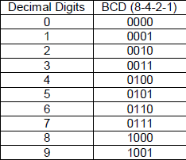

# 7-Segment Display Controller (Vivado)

## Overview
This project implements a **multi-digit 7-segment display controller** in **Xilinx Vivado**, designed to demonstrate clean RTL structure, dataflow-oriented design, and practical digital design skills expected at a **junior FPGA / digital design level**.

The design focuses on **selection logic, modular reuse, and clear signal flow**, rather than board-specific tricks. It is written to be readable, synthesizable, and easy to reason about during code reviews or interviews.

---

## Key Design Concepts Demonstrated

### 1. Dataflow-Driven Control Logic
- A **comparator module generates a control flag (`z`).**
  - This flag acts as a **global select signal** for multiple 2-to-1 multiplexers for multi-digit output.
- Dataflow_seg module resets 9 to 0 when it becomes a multi-digit number.
- Enables clean and deterministic switching between display data paths.

### 2. Modular Multiplexer Architecture
- Multiple reusable **2-to-1 MUX modules**
- Each MUX handles a portion of the digit or segment selection
- Demonstrates structural RTL composition using simple, well-defined blocks

### 3. Multi-Digit Display Support
- Designed to support **multi-digit outputs** using shared logic
- Output paths can be extended for additional digits without redesigning control logic
- Suitable for time-multiplexed or digit-select based display systems

---

## RTL Architecture (High-Level)

This circuit selects a digit from a 4-bit input using multiplexers and a comparator, then converts the selected BCD value into the appropriate 7-segment display and digit-enable signals.

This block implements a BCD-to-7-segment decoder using combinational AND, OR, and inverter logic to generate the correct segment outputs (seg[6:0]) and digit enable signals (an[7:0]) for displaying decimal digits using the table shown below. 

<!---->

   
  <em>BCD-to-7-segment decoder implemented using combinational logic.</em>

## Modules Included

| Module | Purpose |
|------|--------|
| `mux_2to1` | Reusable 2-to-1 multiplexer |
| `comparator_dataflow` | Generates select condition |
| `dataflow_seg` | Prepares segment inputs for values > 9  |
| `bcdto7segment_dataflow` | Converts BCD to 7-segment encoding |
| `top_level` | Structural integration of all blocks |

---

## Why This Project Matters
This project demonstrates:

- ✔ RTL-level thinking (not just behavioral code)
- ✔ Comfort with **Vivado RTL analysis and schematic inspection**
- ✔ Clean modular design suitable for **team environments**
- ✔ Understanding of **mux-based data routing**
- ✔ Practical display interfacing logic often used in labs and industry prototypes

## Author
Designed and implemented as part of a growing FPGA portfolio focused on **industry-ready RTL design practices**.

---

> *This repository prioritizes clarity, correctness, and architectural reasoning — the same qualities expected in professional FPGA development.*